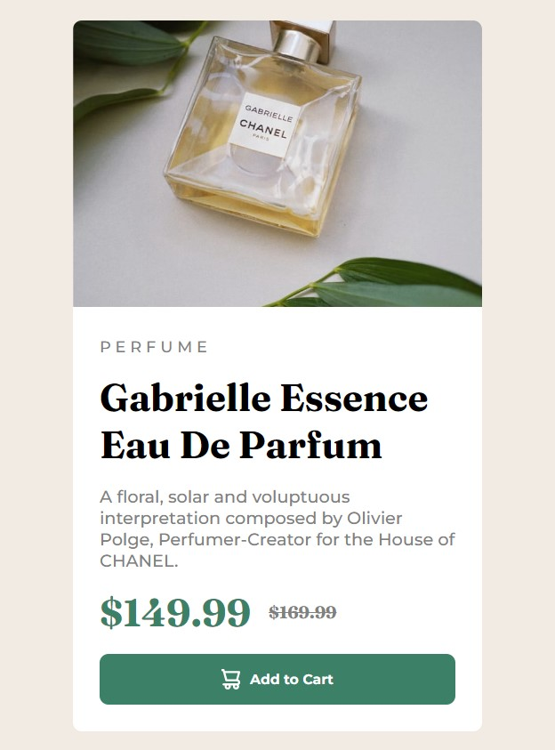

# Frontend Mentor - Product preview card component solution
## Table of contents

- [Overview](#overview)
  - [The challenge](#the-challenge)
  - [Screenshot](#screenshot)
  - [Links](#links)
- [My process](#my-process)
  - [Built with](#built-with)
  - [What I learned](#what-i-learned)
  - [Useful resources](#useful-resources)
- [Author](#author)
- [Acknowledgments](#acknowledgments)

## Overview

### The challenge

Users should be able to:

- View the optimal layout depending on their device's screen size
- See hover and focus states for interactive elements

### Screenshot

**Desktop View Screenshot**

**Mobile View Screenshot**

### Links

- Solution URL: [Add solution URL here](https://github.com/Sharath-1517/Product-preview-page)
- Live Site URL: [(Netlify)](https://products-review-page.netlify.app/)
- Live Site URL: [(GitHub)](https://products-review-page.netlify.app/)

## My process

### Built with

- Semantic HTML5 markup
- CSS custom properties
- Flexbox
- Mobile-first workflow
- [Styled Components SaSS](https://sass-lang.com/) - For styles

### What I learned

I improved my flexbox alignment and use and learnt responsive design using media query for mobile and desktop views.

### Useful resources

- [W3 Schools responsive design](https://www.w3schools.com/css/css_rwd_mediaqueries.asp) - This helped me for learning how to use media query properly. I really liked this resource and will use it going forward.

## Author

- Website - [S Sharath Lingam](https://sharathlingam.netlify.app)
- Frontend Mentor - [@Sharath-1517](https://www.frontendmentor.io/profile/Sharath-1517)
- Twitter - [@sharathlingams](https://www.twitter.com/sharathlingams)

## Acknowledgments

Grace Snow, the workspace admin for the help section from frontend mentor slack community helped me and helps me to structure my code well. I appreciate her dedication and the kindness to help each and every single person of the community in help section.
